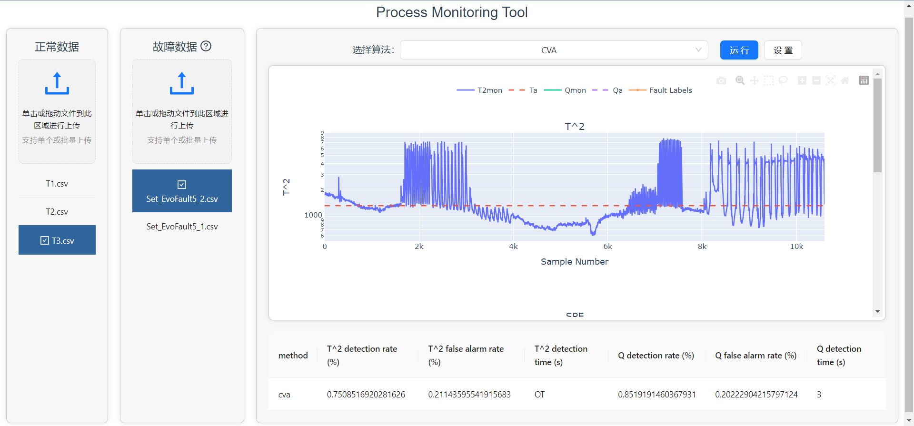
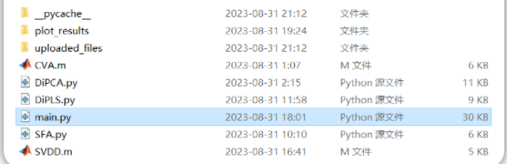
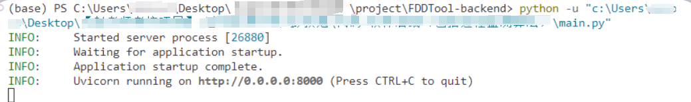
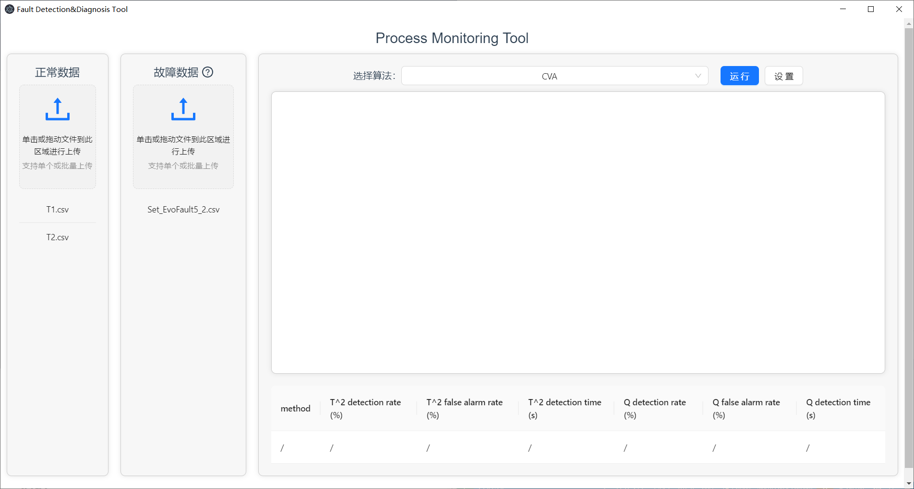
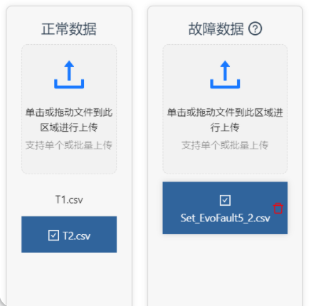
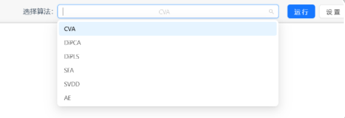
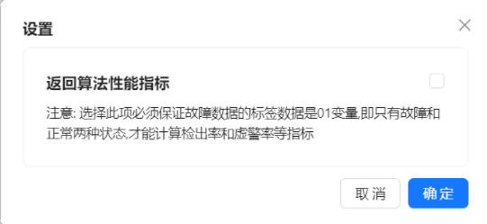

# ProcessMonitoringTool (FDDTool)
[English](README.md) | [简体中文](README_zh.md)
> Process monitoring, also known as Fault Detection and Diagnosis (FDD)

This project has implemented a visualization software for process monitoring called FDDTool.



FDDTool is positioned as a platform for testing process monitoring algorithms and data, which can also be expanded into a real-time process monitoring tool.

It utilizes process monitoring algorithms to train models on imported normal data, then performs process monitoring on imported fault data, and returns the visualization results to the front end.

### Algorithms

**Currently, the software supports a variety of process monitoring algorithms, including CVA, DiPCA, DiPLS, SVDD, SFA, etc.**

> These algorithms are located in the FDDTool-backend folder.

### **Software Technology Stack**

Frontend: VUE3 (frontend framework) + Ant Design Vue (style component library) + Electron (for building desktop applications) + Axios (for communication with the backend)

Backend: Python and FastAPI (for backend services and some process monitoring algorithms) + MATLAB (for other process monitoring algorithms)

# Software Usage

### **Environment Configuration**

> The software adopts a front-end and back-end separated architecture. Before performing various operations, make sure that the backend service is started.

Here are the environment configurations required for running the backend code locally:

- Python libraries: FastAPI (for backend services), Plotly (for plotting)
- Python's MATLAB engine (for calling MATLAB code)
- MATLAB 2020a or later version (for compiling and running MATLAB code)

### **Usage Steps**

#### 1.**Start the backend service** (FDDTool-backend)

- The backend service can be started by running main.py.

  

- (Optional) Alternatively, open a terminal in the backend code folder path and execute the command `uvicorn main:app --reload`.

After starting the service, you can listen for frontend requests in the terminal.



#### 2. Run the frontend of the software (FDDTool-frontend)

- Open a terminal in the path of the frontend code folder and execute the following commands:

```bash
# Install dependency packages
yarn install

# Execute one of the following commands as needed
yarn run serve        # Start the Web service
yarn run build        # Package the Web code
yarn electron:serve   # Start the desktop application
yarn electron:build   # Package the desktop application
```

> The software supports both web and desktop versions.



#### **3. Upload Data**

You can complete the file upload by clicking the upload area or dragging and dropping files into the upload area. The names of the uploaded data will be displayed in the software.

> Note 1: Only CSV files are supported.
> 
> Note 2: For the uploaded fault data, please ensure the last column contains fault label information, i.e., the column indicating the degree of fault or whether there is a fault.

**Data sets in the dataset folder can be used for software and algorithm testing:**

- "T1.csv, T2.csv, T3.csv" are data when the system is running normally.
- "Set_EvoFault1_1.csv" and other files are data when the system has faults (and include a fault label column).

#### 4. Click to Select Data

(This should include both normal and fault data.)



#### 5. Select Algorithm



#### 6. **Run Settings** (Optional)

You can set whether to calculate and return the performance metrics of the algorithm.



#### 7. Click the Run Button

The process monitoring results will be displayed below:


# Other

### Dataset Description

Three-phase flow dataset obtained from the Cranfield Multiphase Flow Facility.

> reference: https://www.kaggle.com/datasets/afrniomelo/cranfield/discussion

In the original dataset: The 'Training.mat' file contains data during normal operation, while 'FaultCase1-6.mat' files contain data during various faults.

This project has made certain modifications to the original dataset:

- Dataset processing 1: For easier processing by Python, a script was written to export all matrix data from mat files to CSV files for storage.
- Dataset processing 2: To facilitate the calculation of detection rates and other metrics, the EvoFault data representing the degree of faults and the fault process variable Set data were combined, appending it to the last column of the Set data.

### Backend API Documentation

1. **Data Import**

URL: `/upload`

Method: `POST`

Description: Imports data and stores it in the backend service.

Request Parameters:

| Parameter Name | Parameter Value | Description |
| -------------- | --------------- | ----------- |
| file           |                 | File        |
| type           | "normal"        | Data type   |

Response:

```json
{
    "message": "success"
}
```


2. **Retrieve Data List**

URL: `/DataList`

Method: `GET`

Description: Retrieves the names of all normal/fault data.

Request Parameters:

| Parameter Name | Parameter Value | Description |
| -------------- | --------------- | ----------- |
| type           | "normal"        | Data type   |

Response:

```json
{
    "data": ["T1.csv", "T2.csv", "T3.csv"],
    "message": "success"
}
```


3. **Delete Data**

URL: `/delete`

Method: `GET`

Description: Deletes specific normal/fault data based on the file name.

Request Parameters:

| Parameter Name | Parameter Value | Description |
| -------------- | --------------- | ----------- |
| file_name      | "T1.csv"        | File name   |
| type           | "normal"        | Data type   |

Response:

```json
{
    "message": "success"
}
```


4. **Process Monitoring**

URL: `/run`

Method: `POST`

Description: Uses data to train models and conducts process monitoring on fault data, returning the process monitoring results—URL link to visualization charts.

Request Parameters:

| Parameter Name | Parameter Value | Description        |
| -------------- | --------------- | ------------------ |
| NormalName     | "T1.csv"        | Normal data file name |
| FaultName      | "Set4_1.csv"    | Fault data file name |
| Method         | "CVA"           | Algorithm name       |

Response:

```json
{
    "html_url": "127.0.0.1:5000"
}
```


